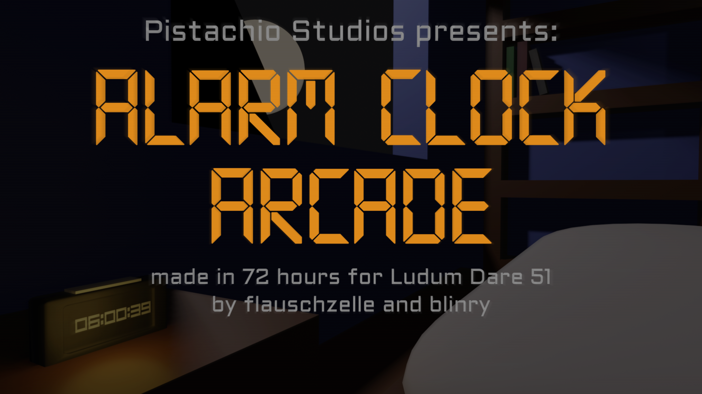
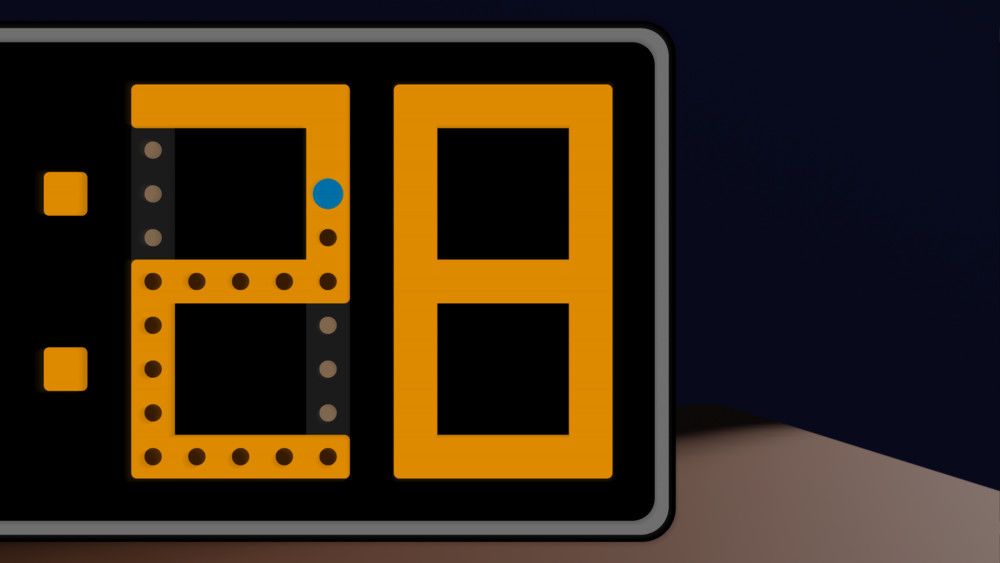
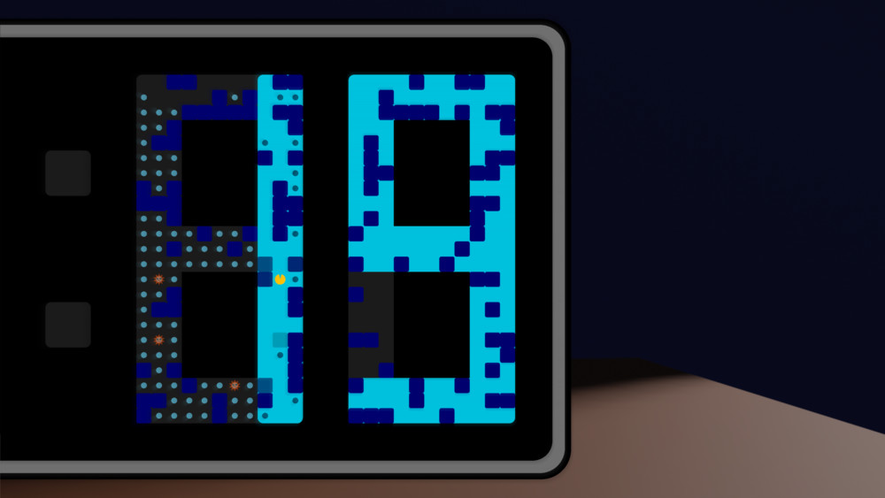

_**Quick, start the alarm to wake up your human! But make sure not to be in a segment when it turns off!**_

*Alarm Clock Arcade* is an arcade-style maze action game that takes place inside the ten seconds digit of a digital alarm clock.

This game is [blinry](https://blinry.org)'s and my contribution to the [Ludum Dare 51](https://ldjam.com/) game jam - an event where you have 72 hours to create a videogame for a given theme. This time, the theme was "Every 10 seconds".

You can find download links and instructions for *Alarm Clock Arcade* on [the Ludum Dare website](https://ldjam.com/events/ludum-dare/51/alarm-clock-arcade). Leave us a rating (until October 21st, 2022) or a comment (any time) there, if you like!

## Development

This game jam's theme immediately spawned a lot of ideas in my head - so may potential for different interpretations of the word "seconds"! But after thinking about getting seconds from the bruch buffet for ten times, finding ten people with the same name as one of their ancestors, visiting locations that are 10" apart in geo coordinates, musical intervals, and many more for a while, we settled for a more obvious understanding. One of the things that happen at a regular ten-second time interval, is - of course - the ten seconds digit on a clock switching to the next one.

We experimented with different types of game mechanics that could have interesting interactions with the changing digit - and after building a prototype inspired by one of the arcade game classics, we found it to be fun and stuck with it.

Like many times before, we used the [LÖVE](https://love2d.org/) game engine for putting the game together. Blinry also made an intro video in Blender, and we recorded some of the sound effects ourselves.

The programming is, as always in game jams, a lot of "quick and dirty", but if you'd like to see it anyway, you can find the game's [source code on GitLab](https://gitlab.com/pistachiostudios/alarm-clock-arcade).

## Gameplay Trailer

Check out this little [trailer video](https://www.youtube.com/watch?v=aU-901F8NSw) that blinry made for our game:

<%= youtube("aU-901F8NSw") %>

