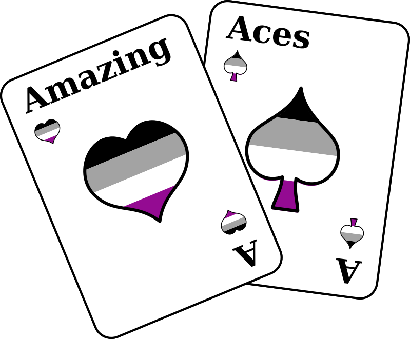

*(deutsche Version: siehe unten)*

I designed this logo for the monthly ace meeting here in Brunswick. It is an event where people on the asexual spectrum can meet each other, talk about whatever they want, and build a local community. Because community is important, especially when most of society still doesn't even know that we exist...

I chose playing cards, because they are a common symbol for the asexual community. The origin of this symbol is quite simple - "ace" sounds like a shortened form of "asexual". Sometimes (but not always), the ace of spades is used specifically for aromantic aces, and the ace of hearts for alloromantic aces.

I also made a flyer (in German) to promote the meeting. If you'd like to help promote the event by printing some of them yourself, you can download the flyer here:

<%= titlepage("amazing-aces-flyer", "Flyer: Amazing Aces") %>

*Ich habe dieses Logo für den monatlichen Braunschweiger Ace-Stammtisch gestaltet. Das ist eine Veranstaltung, bei der sich Menschen im asexuellen Spektrum treffen können, um sich auszutauschen und eine Community aufzubauen. Die ist gerade deshalb wichtig, weil der Großteil der Gesellschaft noch nichtmal weiß, dass es uns überhaupt gibt...*

*Ich habe mich für Spielkarten als Motiv entschieden, weil sie ein übliches Symbol der asexuellen Community sind. Der Ursprung dieses Symbols ist ganz einfach - "ace", also das englische Wort für Ass, klingt sehr ähnlich wie eine Kurzform von "asexual", wenn man es englisch ausspricht. Manchmal (aber nicht immer) wird das Pik-Ass speziell von aromantischen Asexuellen verwendet und das Herz-Ass von alloromantischen Asexuellen.*

*Außerdem habe ich auch einen Flyer dazu gestaltet, um den Stammtisch bekannt zu machen. Falls ihr dabei mithelfen möchtet, indem ihr selbst solche Flyer ausdruckt, könnt ihr hier die Vorlage runterladen.*

