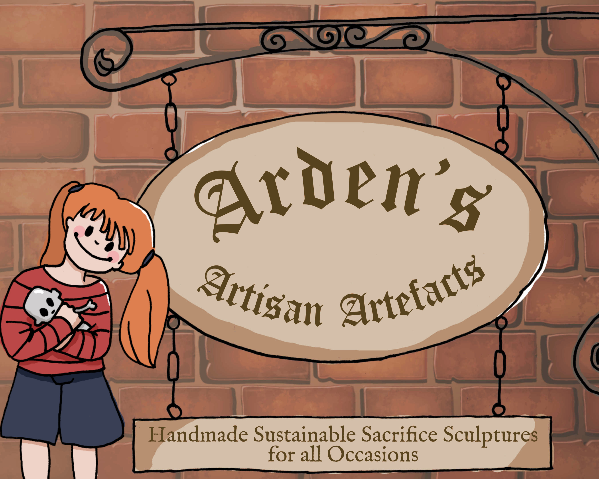
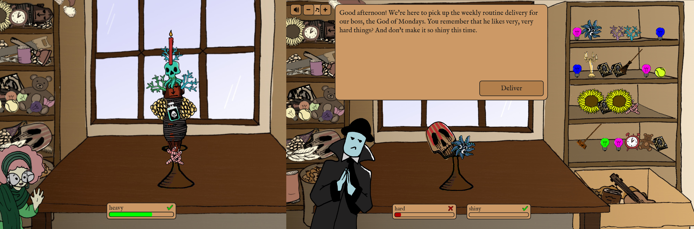
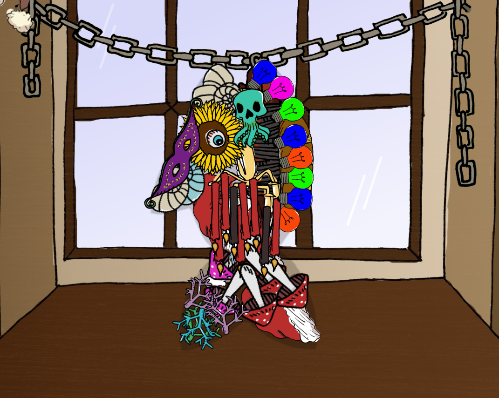
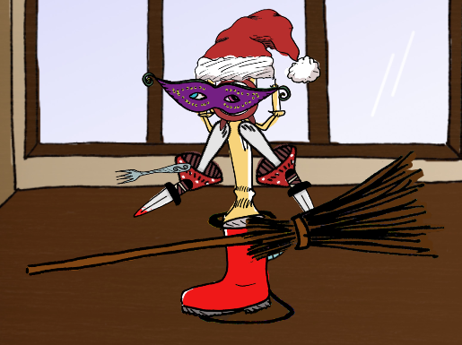
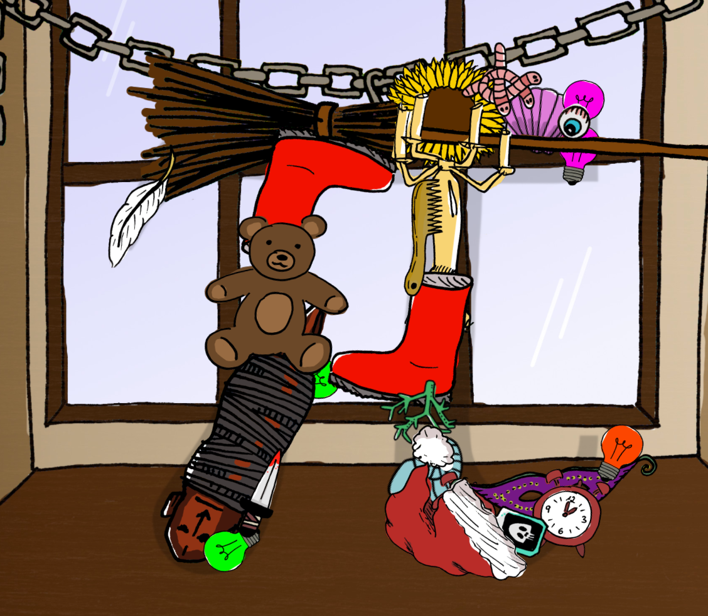

**Sure, sacrifices must be made… but who has the time to actually *make* them?**

*You’re the new owner of “Arden’s Artisan Artefacts”, which offers a convenient solution: handmade, sustainable sacrifice sculptures for all occasions! Today’s modern cultists don’t need to produce offerings themselves – they can stop by at Arden’s Workshop and pick up a built-to-order sculpture exactly according to their wishes!*

This was the third time that I took part in the [Ludum Dare](https://ldjam.com/) game jam (where you build a videogame in 72 hours, fitting a given theme). This time, the theme was "Sacrifices must be made".

I built *Arden's Artisan Artefacts* together with [blinry](https://morr.cc/), [Lena](https://twitter.com/lenaschimmel), [larkinia](https://ldjam.com/users/larkinia) and [Pecca](https://twitter.com/pecc0r).

In our game, you build sacrificial sculptures for a variety of customers, out of things ranging from everyday (plungers, lightbulbs, ...) to rather weird items (skulls, tentacles, ...). Each of the customers has specific wishes - don't make the sculpture too heavy, for example. Or make it look like a fish.

You can download the game from [the Ludum Dare website](https://ldjam.com/events/ludum-dare/43/ardens-artisan-artefacts).

## Development

Just like the times before, this game was coded in Lua with our favorite 2D game engine [LÖVE](https://love2d.org/).

And just like the times before, we worked together in one of our team members' living room, hyper-focusing on the game jam and ignoring almost everything else (but don't worry, we didn't forget to eat and sleep). We had a lot of fun coming up with strange ideas and laughing about all the silly bugs we produced while trying to make everything work like we wanted.

We used a large magnetic whiteboard with little pieces of paper as our shared to-do list, so we wouldn't lose track of all the ideas and tasks. And we tried to do a lot of pair programming this time, which worked really well and helped us better understand each other's parts of the code (and also, it was fun).

## Feedback

On the LDJAM website, we encouraged players to post screenshots of their sculptures in the comments, and we got to see some pretty cool art!

## From the comments:

*The game manages to be outright hilarious with very minimal dialogue.* -themadprogramer

*This is great! It’s so different from everything else and really well executed. Sounds and visuals are all very charming.* -salierus

*This was soooo much fun! Definitly the game I played the most in this jam. When I realized items could be picked from the box, my my, I did spent some time on your game, thank you for that, and well done!* -Garymarance

