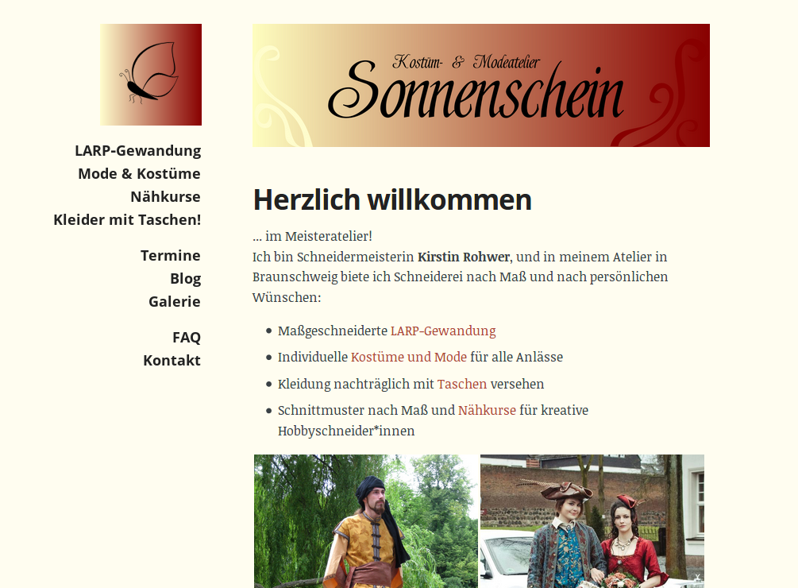

*(deutsche Version: siehe unten)*

I've been doing quite a lot of web design lately, and learning some useful new skills along the way. 

Meanwhile, the website I had made about eight years ago for my own business (I'm a tailor and I mostly make LARP costumes and fantasy-style clothes, e.g. for weddings) was getting older and older, and was in dire need of a fresh look.

So I finally took the time to make myself a new business website, and again I learned quite a lot of new things along the way and built some useful features that the old website didn't have – including a blog-like photo gallery of lots of my works that can be filtered and browsed through by a tag structure!

You can look at the new website at [ateliersonnenschein.de](http://ateliersonnenschein.de). The site is in german only, but my english speaking readers might still enjoy the pictures&nbsp;^^ 

*Ich habe mich in letzter Zeit recht viel mit Webdesign beschäftigt und dabei so einige nützliche neue Dinge gelernt.*

*Währenddessen wurde die Website, die ich vor acht Jahren für mein eigenes Geschäft (Ich bin Schneiderin und schneidere hauptsächlich LARP-Gewandung und Kleidung im Fantasy-Stil, z.B. für Hochzeiten) gebaut hatte, immer älter, und brauchte dringend einen neuen Look.*

*Also habe ich mir endlich die Zeit genommen, mir selbst eine neue Geschäfts-Website zu bauen, und habe auch dabei wieder viel Neues gelernt und viele nützliche Features gebaut, die die alte Website noch nicht hatte – unter anderem eine blog-artige Fotogalerie mit vielen meiner Werke, die mit einer Tag-Struktur gefiltert und durchgeblättert werden kann!*

*Die neue Seite ist schon online und ihr könnt sie unter [ateliersonnenschein.de](http://ateliersonnenschein.de) angucken.*
