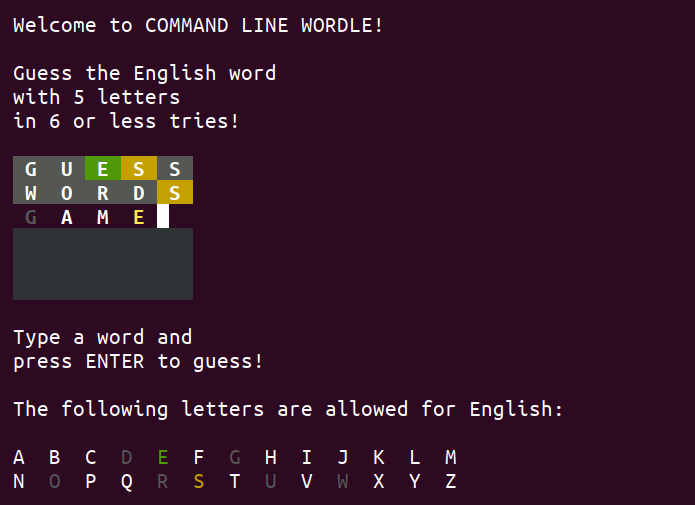

Learning new skills is always easier if I have an interesting project to practice them on. I'm starting a new job where I will be coding in Python, so I made a little game using this programming language that I had never used before.

And as I've already been playing many variants of word guessing games that became popular recently after *Wordle* started the trend, it was an obvious choice of practice project for me.

My version of the game can be played on the command line terminal and supports several different languages and configurable word length.

Besides getting a bit of Python practice, I learned some useful things about ANSI control sequences while making this game. And I learned that it is quite hard to find word lists for many languages online that are long enough for a game like this. If you know a good source, feel free to tell me!

You can find the source code and more info about *cli-wordle* [here on GitHub](https://github.com/flauschzelle/cli-wordle).

