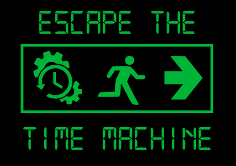
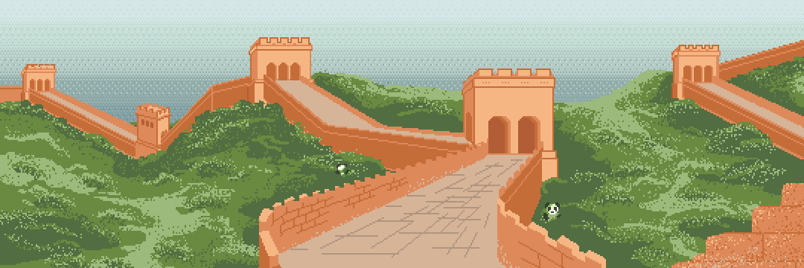
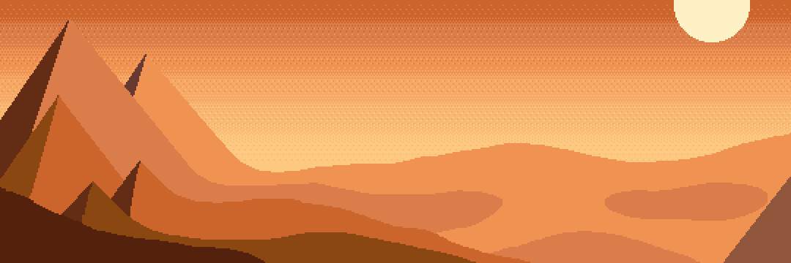
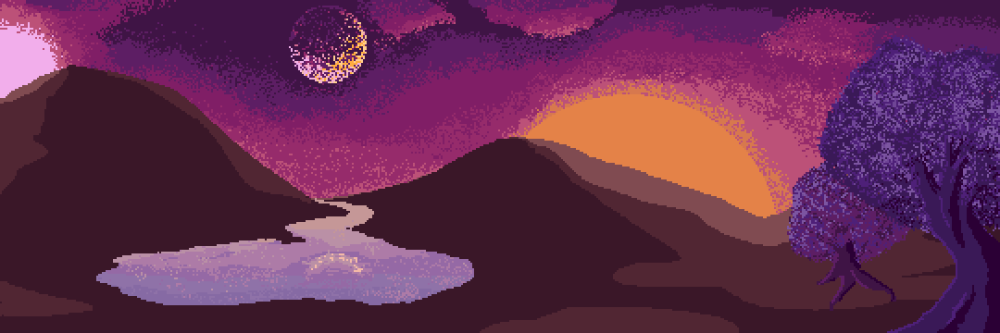
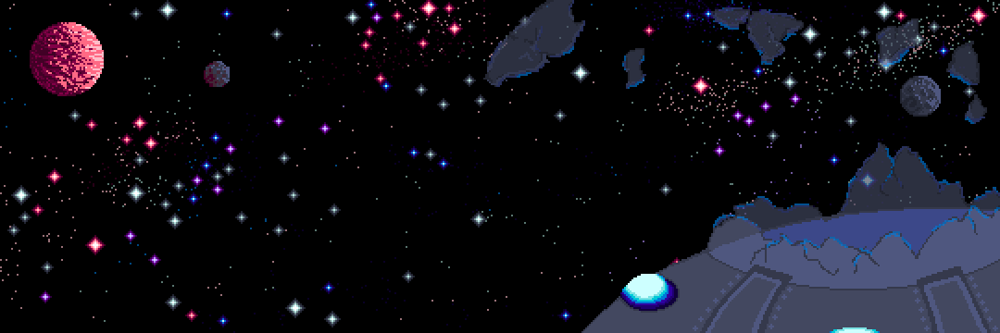
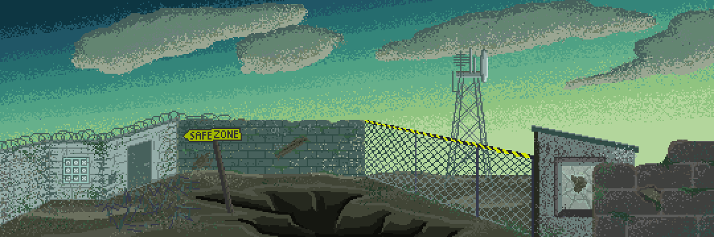
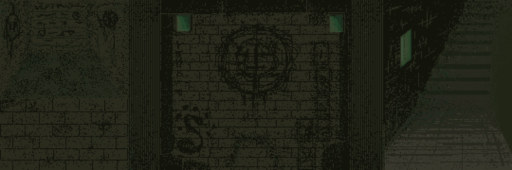
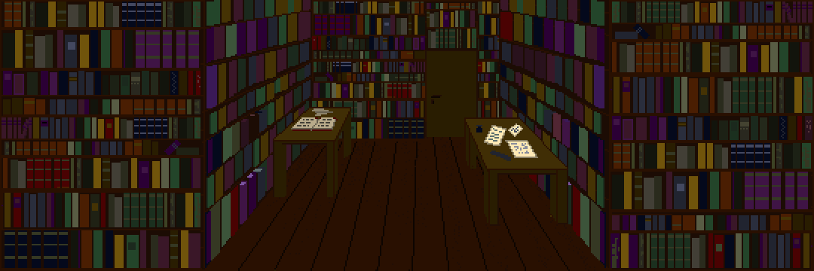
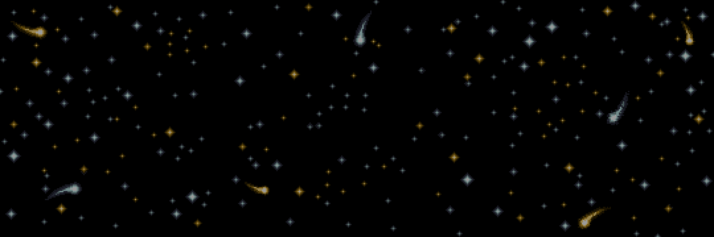

*(Von diesem Artikel gibt es noch keine deutsche Version. Aber ihr könnt euch das Video auf deutsch anschauen, was ganz unten verlinkt ist.)*

Live *escape room* games have become quite popular in the last few years: a small group of players are locked in a room full of mysterious things and have to find their way out. Usually, this involves solving puzzles and finding keys and/or combinations for various locks, until they find the key to the exit door.  
This is a fun concept, but there is one problem: if you've played a specific escape room game once, you already know the solutions and it won't be much fun to play it again.

This semester, I participated in a university project that offers a way to deal with this problem: Virtual puzzles with new contents and solutions in every round. In a team of eleven students, we created the software and parts of the hardware for a virtual escape room game. 

## Setting & Setup

*What have you found here? Could that actually be... a time machine? As soon as you've stepped inside, your first time travel begins. But the time machine is quickly running out of energy. Can you return home to the present before the battery is empty?*

The time machine takes you to a few different times and places before you can return. In each time, there are specific problems that you have to solve before you can continue your travels.
The times/places and puzzles are randomly chosen or generated, so that each round looks different, and even if you happen to see the same place twice, the puzzles won't be much easier than the first time.

The cockpit of the time machine is equipped with various game controller hardware like a keypad, a joystick, an RFID reader, and even a laser harp. The controllers are built with *Arduino* microcontrollers. The players can use all of them to interact with their surroundings.

The outside world is projected onto three large semi-transparent walls that are placed in front and on the sides of the time machine cockpit.

## Development & Art

The main software was written in *Java*, using the *processing* library for the visual parts.

In addition to my part of the programming work (including one action game and one puzzle game, each with two different design variants), I made nearly all of the background graphics for the different places.  
This gave me a lot of exercise in creating pixel art (and some pain in my hand, because I worked on each of them for at least half a day):

I also designed the logo you have seen at the top of this page, which we printed on t-shirts for the event where we presented our project.

## Presentation

We presented the finished project to the public at an event alongside all other software development project teams from the same semester. We set up the virtual escape room on the campus and let visitors try it out. Next to the entrance, we hung up a poster that shows some important facts about our project (in german):

<%= titlepage("presentation_poster", "presentation poster for the escape room game") %>

## Awards

There was a jury going around and rating all the different projects, and after a few hours, the award ceremony took place. We actually won **two** awards - the first place for this year's best project, and the additional award for the best teamwork effort!

Here is the whole team (including three of our four mentors) with the award, standing inside the escape room:

## Coverage

In addition to some articles in the local newspapers, there was a camera team from a local tv station that did a report about the event and three people from our team were invited to an interview shortly after the presentation (video in german):

<%= youtube("jpaMpjrb2Rw", start: 1463) %>

We will also probably set up the escape room again for some upcoming events at our university.

