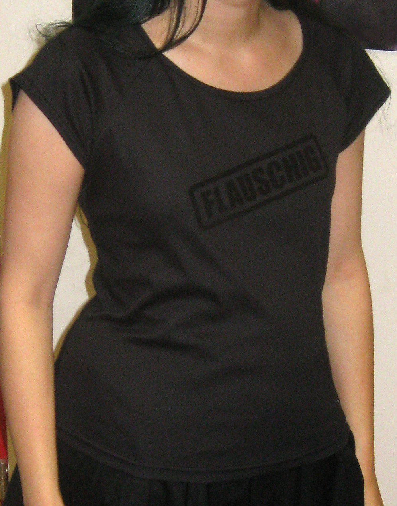

*(deutsche Version: siehe unten)*

This was my first time to make a t-shirt motif using the plotter in our local hackerspace. Because "flauschig" (it could be translated as "fluffy" in some contexts but actually there are many different meanings, it's hard to explain...) is one of my favorite words, I chose to make a motif that looks like someone stamped that word on my black t-shirt in black fluffy ink :) It is made with flockprint foil, so it actually has a fluffy texture and it's visible even though printed in black on black.

*Dies ist das erste T-shirt-Motiv, das ich mit Hilfe des Schneidplotters in unserem lokalen Hackerspace gebastelt habe. Weil "flauschig" eins meiner Lieblingswörter ist, habe ich mir ein Motiv ausgedacht, das aussieht, als hätte jemand mich mit flauschiger schwarzer Tinte abgestempelt :) Es ist mit Flockfolie gemacht, hat also tatsächlich eine flauschige Oberfläche und ist deswegen auch in schwarz auf schwarz trotzdem erkennbar.*
