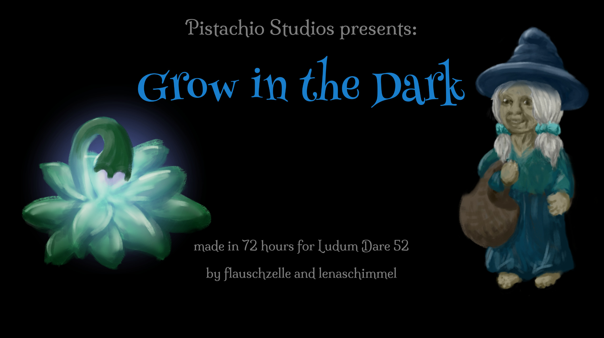

_**The old witch wants to pick all the glowing fruits in her garden tonight. Place some signs to help her find the way!**_

*Grow In The Dark* is a puzzle game where you help an old witch and her ghost friends find the shortest way to pick all the fruit in her garden.

[Lena](https://ldjam.com/users/lenaschimmel) and I made this game for the [Ludum Dare 52](https://ldjam.com/) game jam - an event where you have 72 hours to create a videogame for a given theme. This time, the theme was "Harvest".

You can find download links and instructions for *Grow In The Dark* on [the Ludum Dare website](https://ldjam.com/events/ludum-dare/52/grow-in-the-dark). Leave us a rating (until January 27th, 2023) or a comment (any time) there, if you like!

## Development

We had less time than usual for this jam, caused by several different factors: 

- The jam started and ended a few hours earlier than usual, pulling more of it into a time range where we're usually sleeping. 
- We also had an organizers' meeting for a local group that we're both part of, which had been scheduled before we knew about the jam and took up all of saturday afternoon. 
- And Lena had to work on monday, which left me working on the game alone for most of that day.

The unusually limited time, combined with us being very used to expecting a certain possible scope for a Ludum Dare game, caused us to still be very far from finished shortly before the submission time. So if some parts of the game feel like they were implemented in a rush - it's because they actually were.

As usual, we took a lot of time to brainstorm for ideas that would fit the theme and be fun to play. This time, the hardest part of this was thinking of a game mechanic that we both liked and that wouldn't be too complicated - Lena loves sandbox-like resource optimization games, but those are mostly boring for me. I prefer classic puzzle games, but it's really hard to come up with an interesting twist to make something new in that genre.

We started the prototyping phase with a shared idea of 'you have to find the shortest path through a field of fruits (with some obstacles) to pick all of them', testing both variants where the player directly controls a character walking through the garden and where the harvesting is done by "robots" (later re-used as ghosts to fit with the witchy setting) that can be controlled via direction markings on the floor. 

While Lena built a scaling framework for the grid-based level graphics, a colour-changing filter for the dusk animation (I love it, this sets such a great mood!), and a level editor (that ended up being used a lot less than we hoped, due to the time running out before we could design many levels), I first coded some logic for parsing level config files, picking fruit, placing tracks of footprints, and the fruit going bad if you take too long.

Apart from that, and writing the intro texts for the levels, I devoted most of my time to the visual aesthetic of the game. I recently discovered the fun of digital painting, so I set up Krita on my old tablet-convertible laptop. 

It was a lot of fun to paint the old witch, her ghost friends, the plants and their glowing fruit, wooden signs with direction arrows, footprints, and some piles of rocks for the obstacles. 

When I made the last few paintings (a house and some grassy textures for the ground), the deadline was already close, so those were made very hastily and I'm not really proud of them - nor of the integration of the paintings with each other in the game: If I had had more time, I would probably have made the witch, signposts and plants throw shadows on the ground, some fruit show up in the basket after being picked, etc.

I also recorded some sound effects at the last minute, by sending myself voice messages and editing them in Audacity. We definitely didn't have time to make our own music, so we picked a nice track from [Kevin MacLeod's](https://incompetech.com) treasure trove of a website as the game's music once again. 

Due to the bad timing, we also couldn't let any other people playtest the game before submission this time. Yeah, our general learning from this jam seems to be: don't overestimate the time we have and pick a realistic scope!

While this is definitely not the game I'm most proud of, I still think it's quite pretty with all the glowing things and night-time atmosphere. And you should check it out if you like puzzle games and glowing stuff :)

Like many times before, we used the [LÖVE](https://love2d.org/) game engine for putting the game together. The programming is, even more than usual in game jams, a lot of "quick and dirty", but if you'd like to see it anyway, you can also find the game's [source code on GitLab](https://gitlab.com/pistachiostudios/Grow-In-The-Dark).
