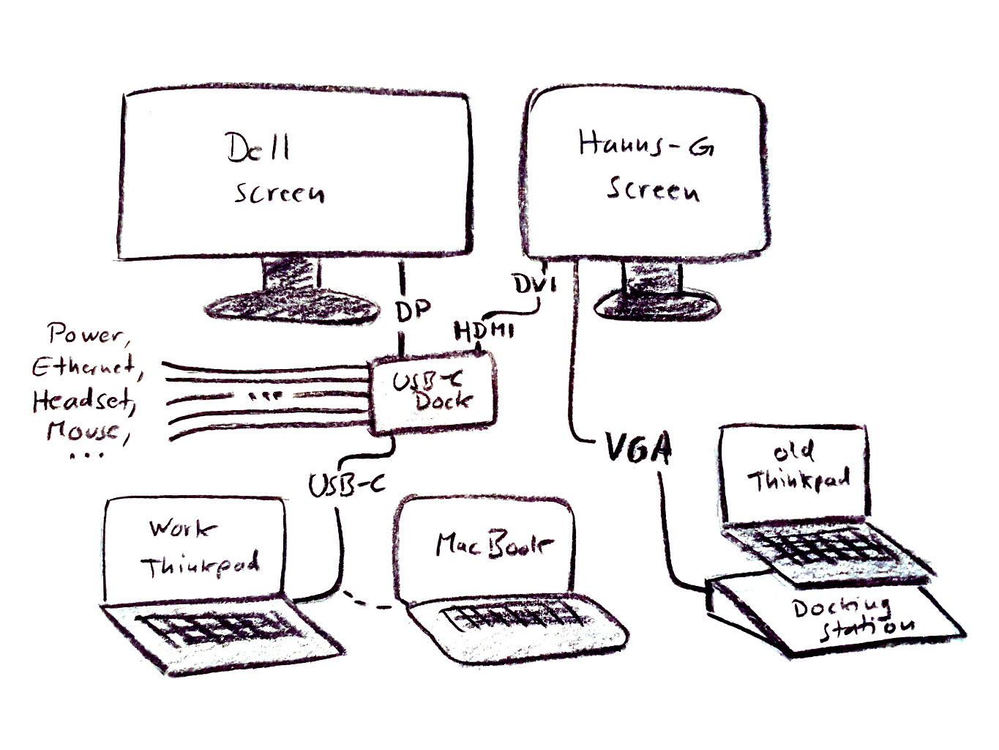
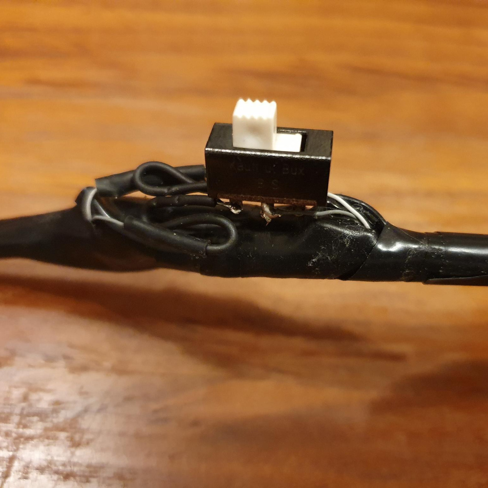

This electronics project is probably not needed very often, but in case anyone has a similarly unusual hardware setup and a similar problem, I might as well document what I did to solve it...

*TL;DR: I built this modified cable so I can virtually "unplug" one of my two external screens from my USB-C docking station without actually pulling any plugs.*

## The problem: (kind of) incompatible hardware of different ages

On my desk at home, there are two external computer screens. One is a **24" Dell monitor in 16:9 format** with a rather large resolution, which I got from my employer for my software development job. For which I also got a new ThinkPad laptop, and a USB-C dock so I can easily switch all my peripheral hardware between the work laptop and my private laptop without unplugging and re-plugging more than a handful of cables twice a day. The Dell screen is connected to the dock with a DisplayPort cable.

The other screen is a **19" Hanns-G monitor in 5:4 format** and with a lower resolution than the Dell, but about the same physical height, so they fit next to each other nicely. I already had that one before I got all the new hardware for work, and I also have it connected to the dock (using an HDMI/DVI cable) so my work laptop can use both of the external screens in addition to its own. Works fine, no problem so far :)

My current private laptop (also a ThinkPad) is about 10 years old and neither supports multiple external screens nor USB-C docks anyway, so I have it on its own old-fashioned dock, connected to the Hanns-G screen with a VGA cable. Still no problem so far :)

But now I also have a "new" private laptop that will probably have to replace the old one some day, and works as an addition to it until then. This one is a used MacBook Pro, aged somewhere in between the two ThinkPads. This one does support USB-C - in fact, it hardly has any other connectors built in, so I really need to use the dock if I want to connect any of my stuff like headset, webcam, mouse, ethernet, etc.  

It might also support multiple external displays, but only if they are connected directly - which would mean even more cables on my desk, and having to unplug and re-plug them all the time. I'm not doing that, especially not while I'd have to unscrew the VGA cable from the other dock every time...

This text is probably a bit confusing if you're not me, so I drew you a picture. Here is a simplified version of the things on my desk that are relevant for this project:

When I connect the MacBook to the new dock, it works fine with most of the other connected hardware, but not the screens. Turns out: MacOS doesn't support the _DisplayPort MST_ standard that is needed to use both external screens with the dock. So when I use the MacBook with the dock, the MacBook assumes that there's only one screen connected and the dock shows the same image on both screens. But on the Dell screen, it is weirdly stretched and blurry - because the MacBook only "sees" the Hanns-G screen and sends the image data in the resolution for that one. And there is no way to convince it to use the Dell's resolution, as long as the Hanns-G is still plugged into the dock.

Now I don't want to pull the HDMI plug out of the dock every time I switch from work to private stuff, especially with the sockets in the dock being so close to each other. So there had to be some other way to make the dock think that this screen is not connected...

Just switching the monitor off doesn't help, of course - if it was that easy, I wouldn't be writing a long, rambly text about it right now :D

Researching a possible solution, I learned a lot about the [HDMI](https://en.wikipedia.org/wiki/HDMI) and [DVI](https://en.wikipedia.org/wiki/Digital_Visual_Interface) standards. They're more similar than one might think from looking at the plugs, and that's why my cable can have an HDMI plug on one end and a DVI plug on the other without needing any fancy active components.

And the reason why my dock would usually still recognize the monitor when it's switched off (or even unplugged from its power supply) is a protocol called **DDC**. The [Display Data Channel](https://en.wikipedia.org/wiki/Display_Data_Channel) provides information about the display and doesn't need its own power supply  - it is powered by the device on the other end of the connection, just like DVI/HDMI's data transmission in general. That's also the reason why I can switch off the screen and my computer will still send image data to it - it doesn't even know if the screen is switched on or not.

So if I want to make the dock "forget" what kind of screen is plugged in, I need to make sure that it doesn't get the DDC signal. I'll explain how I did that later, but first some more info, because it turned out that disconnecting only the DDC signal is not enough. 

Without DDC, the screen is still detected, but now it can't send any info about the supported resolution. So the device on the other end just assumes the minimum resolution that any DVI monitor would have, and the weirdly stretched image on the Dell screen gets even worse.

There is another channel in the HDMI/DVI standard that is used for detecting if a monitor is plugged in - it is called **Hot Plug Detect**. But disconnecting that one alone is also not enough - if I do it while the MacBook is connected, it remembers which screen was there before and just assumes it is still there - but the screen doesn't get image data any more.

If I disconnect the *Hot Plug Detect* channel before connecting the MacBook, it sometimes correctly detects the Dell monitor instead. But that looks like a sensitive timing issue I don't want to rely on.

Luckily, I already have the solution - disconnecting both *DDC* AND *Hot Plug Detect* seems to work reliably, so that is what I did. And now I can show you how.

## Surgery on a cable

Thanks to [blinry](https://blinry.org), who provided a spare cable for this experiment and did the surgery together with me! It was much more fun this way than doing it alone :)

First, we cut open the outer isolation of the cable somewhere in the middle, and bent it out of the way with some sticky tape.

The next layer is a braided tube of silvery wires: the ground connection for the plugs' metal casing. We carefully cut that one open, too. And the aluminium foil shielding below it.

Now we can see seven very thin wires, and some thicker twisted pairs that each have another layer of shielding. The shielded ones are where the actual image data are transmitted - we can leave those alone.

We searched for detail info on this specific model of cable, hoping it would tell us which of the seven thin wires are the ones we need to cut. But we didn't find info on this exact one, so we resorted to the classic way of science: trial and error :D 

After cutting all seven and using a multimeter to find out which wire is connected to which pin on each of the plugs, we got some very strange results, but also the information that we needed.

In case you happen to have the exact same cable, here is what we found:

- yellow: +5V (HDMI pin 18, DVI pin 14)
- orange: Ground (HDMI pin 17, DVI pin 15)
- purple: DDC clock (HDMI pin 15, DVI pin 6)
- **gray: DDC data (HDMI pin 16, DVI pin 7)**
- **white: Hot plug detect (HDMI pin 19, DVI pin 16)**
- black: ???
- red: ???

The black and red wires didn't seem to be connected to any of the pins. Strange, but the cable obviously worked, so whatever... let's go on.

We soldered some extra pieces of wire to all the ends we had just cut and tested the connections by sticking them into a breadboard.

After we had experimentally confirmed that disconnecting gray and white at the same time was the thing we need, we soldered all the other ones back together, isolating them with shrink tube and tape.

We pulled the gray and white little wires to the outside through the braided stuff, and reconnected that with an extra piece of wire and some aluminium foil. 

Then we dug up a 2-pole switch from a basket of old computer parts in the basement. It is massively oversized, but that's what was available. We soldered some wires to that as well and now it lives on my desk with the breadboard until I find a smaller switch and build a nice casing for the final version.

Now I have a monitor cable that can be virtually unplugged without actually pulling out any plugs!

## A smaller switch and a plastic case

*Update (November 2022):*

I found a small 2-pole slide switch, removed some of the excess wire I had used for the other one, and soldered the small switch to the white and gray wires.

Then I modelled and 3D-printed a case for it.

I screwed it shut, filled in the 'ON' and 'OFF' text with some white acrylic paint, and now it lives next to the dock, beside the general chaos of *I have too many cables on my desk...*

