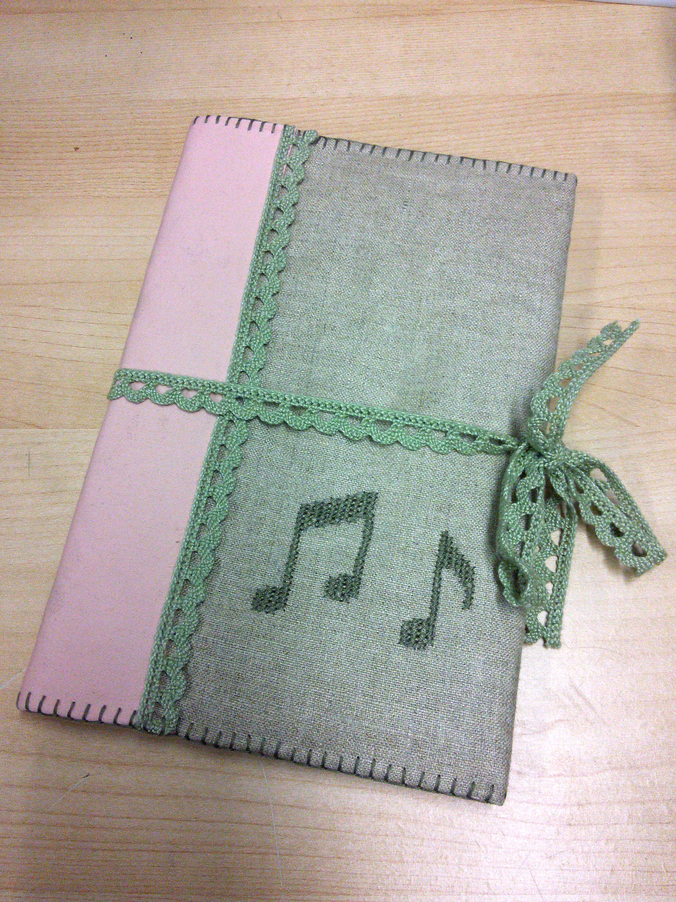
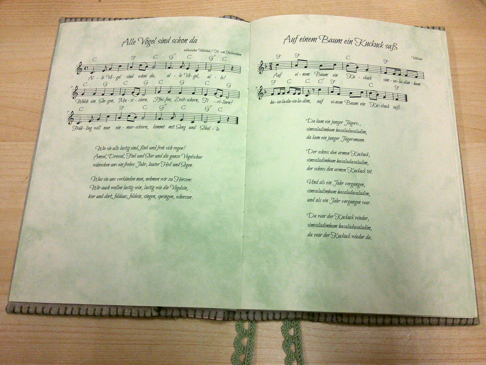
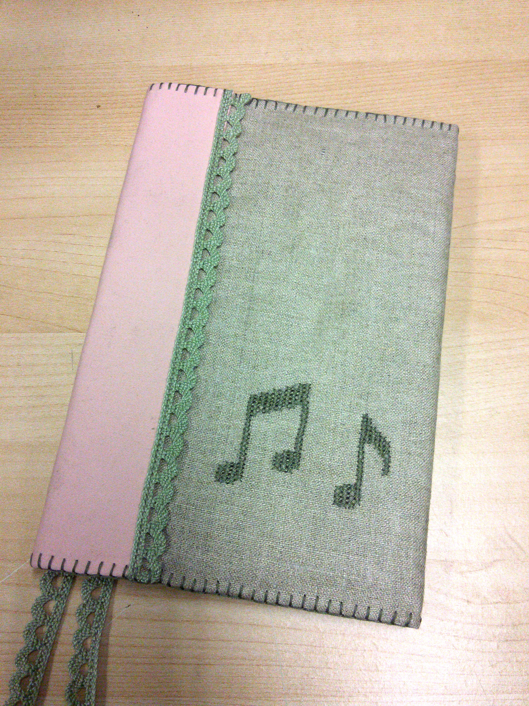

In fantasy LARP (live action role playing), one of my most played characters is a hobbit girl named Kamilla. Just like my real self, she loves music and she likes to sing and play on her little lute (which is actually an unusually shaped ukulele).  
And just like for my real self, that is easier for her if she has sheet music to look up the melodies, chords and lyrics. Until now, I used a collection of various songbooks and loose sheets of paper that was getting more and more chaotic and heavy to carry around, while I didn't ever sing most of them at all when I was playing Kamilla.

So it was time for Kamilla to get her own songbook with only the songs that she actually knows. I used this project as an opportunity to practice a new skill: typesetting music notation with [LilyPond](http://lilypond.org).
Currently, the book has 36 songs, set on 40 pages, and it can be expanded later when I learn new songs that fit into Kamilla's story.

I printed the songbook's pages on marbled paper and sewed them together in chunks of eight pages, plus a back and front cover page, each with a glued-on piece of cardboard. When I want to add new pages, I can cut open the seam that binds the back cover to the last page, and sew in the new pages between them - at least, that's how I plan to do it, I haven't tested it yet.

Grey cardboard and visible binding are neither pretty nor sturdy enough for a fantasy larp book, so I made a protective textile cover for the book. The inside is padded with soft fluffy cotton and the outside is unbleached linen. As Kamilla's favorite colors are pink and green, I added a stripe of soft pink fabric along the spine of the book and a pale green lace trim along the edges of the pink stripe. Another piece of the same pale green lace can be tied in a ribbon around the book to keep it closed.  
I also decorated the front cover with some cross stitch embroidery in the shape of musical notes. Cross stitch always reminds me of pixel art, but at the same time it has a rustic look about it that fits nicely for a hobbit girl in an old-fashioned fantasy world.

