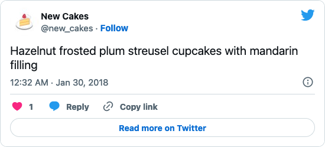
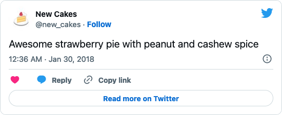

Today, I learned how to build Twitter bots with [Tracery](http://tracery.io/). My first creation is [**@new_cakes**](https://twitter.com/new_cakes) - Your friendly neighborhood pastry chef's newest creations ;) It tweets random, yummy-sounding names of sweet pastries. Be inspired and enjoy your cake!

No matter if you prefer cupcakes...

... or pie ...

... whenever you don't know what to bake, **New Cakes** can give you lots of inspiration :)

You can find the source code of this bot at [Cheap Bots, Done Quick!](https://www.cheapbotsdonequick.com/source/new_cakes).

__Update 2022-11-12:__   
  
It looks like Twitter is rapidly devolving into a dumpster fire of a security risk. Therefore, I disabled the bot's access to the Twitter account today. So there won't be any new tweets from now on, but you can still scroll through all the old ones if you'd like some inspiration for baking. I might also put up an archive of the bot's tweets somewhere, but that's still a work in progress.
