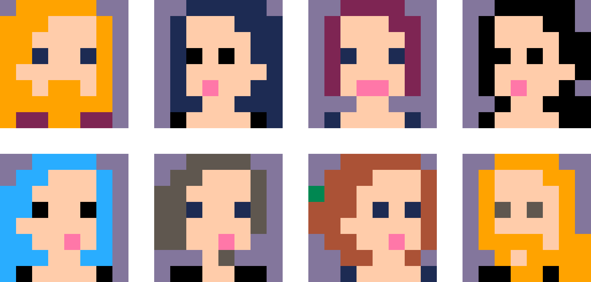

I felt like making some pixel art today, and so I started with a self-portrait that I might use as a profile picture somewhere. 32x32 pixels is a good size to have some visible details, and I was most used to the db32 color palette, so I started with that:

Then, I tried how much lower resloution I could use while still being recognizable, and got a bit silly... having petrol blue hair will really help if I ever have to be identifiable in a 2x2 pixel image :D

At last, I tried a different color palette – I had recently seen some pico8 games and was curious to see if I could picture myself as 8x8 pixel sprite in the pico8 palette. It was quite easy, of course – just had to change the colors from the 8x8 version above. And because it was fun, I also made pico8 8x8 portraits of some other people I know.

*Heute hatte ich Lust, mal wieder Pixelart-Bilder zu machen. Angefangen habe ich mit einem Selbstportrait, das ich vielleicht mal irgendwo als Profilbild benutzen kann. 32x32 Pixel ist eine gute Größe, um noch ein paar Details zu erkennen, und ich war schon an die db32-Farbpalette gewöhnt, also habe ich zuerst damit angefangen.*

*Danach habe ich ausprobiert, wie klein ich die Auflösung machen kann und trotzdem noch erkennbar sein, und es wurde ein Bisschen albern... Fazit: petrolblaue Haare sind echt hilfreich, falls ich mal auf einem 2x2-Pixel-Bild identifiziert werden müsste... :D*

*Zuletzt habe ich noch eine andere Farbpalette ausprobiert – ich hatte kürzlich einige pico8-Spiele gesehen und war neugierig, wie ich als 8x8-Pixel-Sprite in der pico8-Farbpalette aussehen würde. Das war einfach – ich musste ja aus dem oberen 8x8-Pixel-Bild nur die Farben ändern. Und weil es so viel Spaß gemacht hat, habe ich dann noch ein paar andere Leute ebenfalls als 8x8-Pixel-pico8-Bilder portraitiert.*
