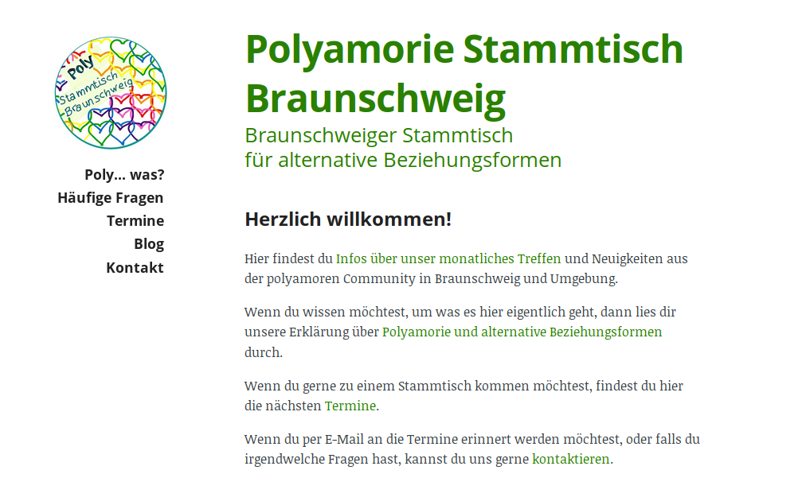

*(deutsche Version: siehe unten)*

Until recently, our local monthly polyamory meetup only had a rather improvised tumblr blog as its website. We wanted to improve that situation, so I offered to build a website with a bit more content.  
The new site is a sibling of the [Amazing Aces Website](/amazing-aces-website/) that I made last year - which means I reused most of the layout and filled it with new text, pictures and colors. It is also made with the static site generator [nanoc](http://nanoc.ws). You can look at the site at [poly-bs.de](http://poly-bs.de). (it's only in german, sorry to my english speaking readers.)

*Bisher hatte der lokale Polyamorie-Stammtisch nur einen improvisierten tumblr-Blog als Website. Um das zu verbessern, habe ich eine neue Website mit mehr Inhalt gebaut.*  
*Die neue Seite ist ein Geschwister von der [Website der Amazing Aces](/amazing-aces-website/), die ich letztes Jahr gemacht habe - das heißt, ich habe das Layout größtenteils wiederverwendet und es mit neuen Texten, Farben und Bildern befüllt.*  
*Auch diese Seite habe ich mit meinem aktuell liebsten Webseiten-Tool [nanoc](http://nanoc.ws) gebaut. Sie ist jetzt online unter [poly-bs.de](http://poly-bs.de).*
