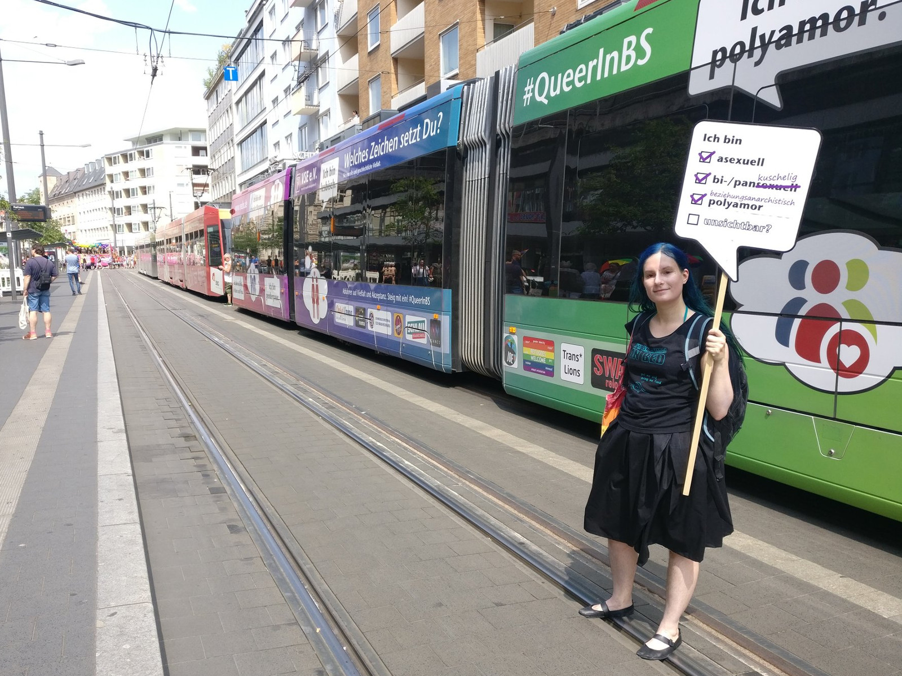
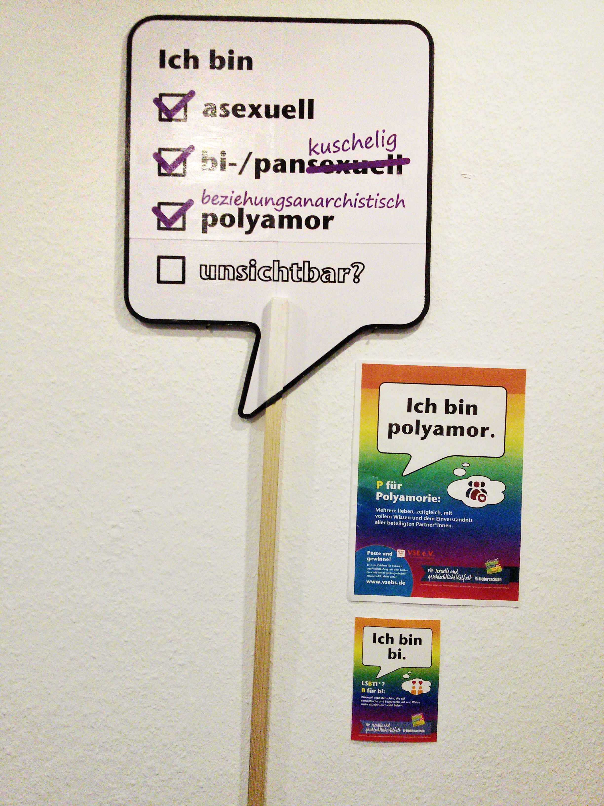

*(deutsche Version: siehe unten)*

For the last few months, there has been a [rainbow tram](http://blog.vsebs.de/abfahren) rolling around the city where I live, accompanied by a matching educational campaign with posters and postcards. It shows many different examples of queer identities, even some that often tend to be forgotten. I was happy to see that e.g. **polyamory** was included there - but unfortunately, **asexuality** stayed invisible once again.

Therefore, I had the idea to make a DIY sign in the same speech bubble design, to improve asexual visibility. I put this plan into action for our local pride parade, and I also included some other identities that often stay invisible.

I cut the speech bubble out of thin plywood and glued the motif (printed on paper) onto both sides. If you'd like to make a similiar sign, you can download my templates as svg files for the [front](pride-speech-bubble-front.svg) and the [back](pride-speech-bubble-back.svg) here.

*Die Stadt, in der ich wohne, hat seit einigen Monaten eine [Regenbogen-Straßenbahn](http://blog.vsebs.de/abfahren/) und eine dazu passende Aufklärungskampagne mit Plakaten und Postkarten. Sie zeigt viele Beispiele von queeren Identitäten und enthält sogar einige Begriffe, die sonst oft vergessen werden. Ich habe mich sehr gefreut, dass z.B. **polyamor** dort vorkommt - aber **asexuell** blieb leider mal wieder unsichtbar.*

*Deswegen hatte ich die Idee, selber ein Schild im gleichen Sprechblasen-Design zu basteln, um für asexuelle Sichtbarkeit zu sorgen. Diesen Plan habe ich dann anlässlich des CSD in die Tat umgesetzt, und auch gleich noch ein paar weitere Begriffe, die oft unsichtbar bleiben, mit erwähnt.*

*Das Schild ist aus Sperrholz ausgesägt und von beiden Seiten mit dem Motiv beklebt, was ich vorher auf Papier ausgedruckt habe. Falls ihr auch so ein Schild basteln wollt, findet ihr hier die Vorlagen für die [Vorderseite](pride-speech-bubble-front.svg) und die [Rückseite](pride-speech-bubble-back.svg).*
