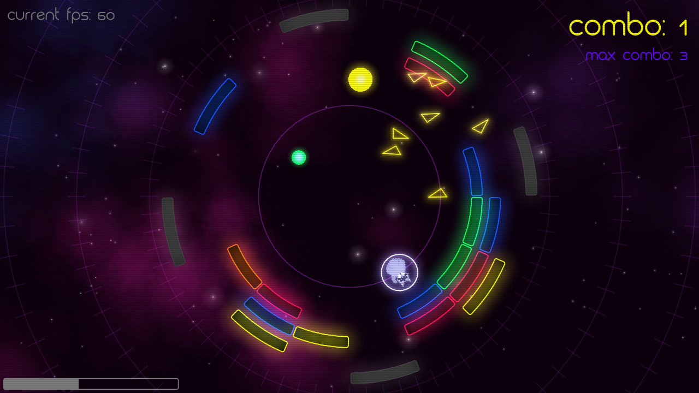
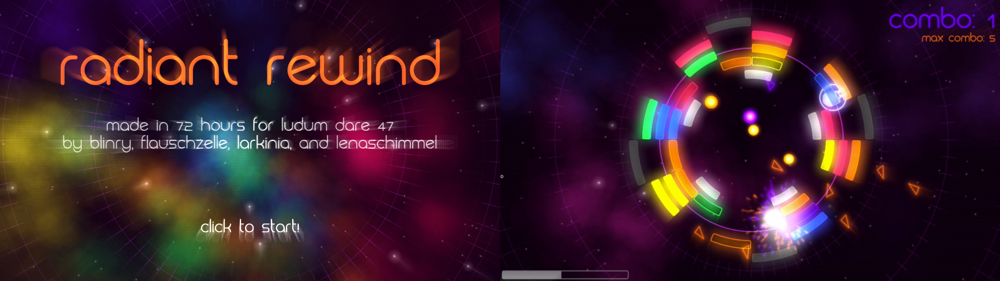

_**Breakout! Slow motion! Time travel! Oh and also, you’re a raccoon, looping around an orbit in space.**_

It's been a while since I last took part in my favorite game jam, but last weekend, it was time once again!

*Radiant Rewind* was made for [Ludum Dare 47](https://ldjam.com/) - an event where you have 72 hours to create a videogame for a given theme. This time, the theme was "stuck in a loop".

I built this game together with [blinry](https://morr.cc/), [larkinia](https://ldjam.com/users/larkinia) and [Lena](https://twitter.com/lenaschimmel). We used the 2d game engine [LÖVE](https://love2d.org/), which was also used for several of our previous game jam entries.

You can download the game from [the Ludum Dare website](https://ldjam.com/events/ludum-dare/47/radiant-rewind) and leave us a rating (in the next three weeks) or comment there, if you like.

You can also download *Radiant Rewind* directly [here for Windows (64bit)](https://blinry.gitlab.io/radiant-rewind/downloads/blinry-radiant-rewind-win64.zip) and [here for Linux or MacOS](https://blinry.gitlab.io/radiant-rewind/downloads/blinry-radiant-rewind.love). For the Linux/MacOS version, you need to have [LÖVE](https://love2d.org/) 11.3 installed to play it.

You can also find the game's [source code on GitLab](https://gitlab.com/blinry/radiant-rewind) if you're interested.

Lena also made a little [trailer video](https://www.youtube.com/watch?v=txWLdFpt_Ro):

<%= youtube("txWLdFpt_Ro") %>

## Post-jam version

After the deadline for submitting to the jam, we made some more changes to the game and published them in a **post-jam version**. You can download the post-jam version [here for Windows (64bit)](https://dielenamaria.gitlab.io/radiant-rewind/downloads/dielenamaria-radiant-rewind-win64.zip) and [here for Linux or MacOS](https://dielenamaria.gitlab.io/radiant-rewind/downloads/dielenamaria-radiant-rewind.love). The [post-jam version's source code](https://gitlab.com/dielenamaria/radiant-rewind/-/tree/postjam) is also available on GitLab.

The post-jam version has many new features, including: 

- improved physics  
- even prettier graphics, mostly for the balls and particles  
- a mute button for the music (**M**)  
- more flashy background animations and a button to disable them (**E**)  
- **configurable controls** so you can play with mouse, keyboard and/or gamepad.  

The full changelog can be found on [our ldjam page](https://ldjam.com/events/ludum-dare/47/radiant-rewind).

## Basic usage

Use your mouse (or other pointing device of your choice) to move along the track. Touch the ball to change its course. Clear all blocks to advance to the next level.

**Combos and powerups:** Hit multiple same-colored blocks in a row to advance the combo count and unlock a powerup. Then press **C** to activate it, and do it before you break your combo!  

You get *multi balls* for red, orange or yellow combos, and *big balls* for green, blue or purple combos.

**Time control:** Hold **ctrl** to slow down time for extra precision. Hold **space** to rewind time. The bar in the lower left shows the amount of time that you can go back. Rewinding time resets your combo count to zero.

## Controls overview
_(for the jam version)_

**Mouse:** move raccoon  
**Hold space:** rewind time  
**Hold ctrl:** slow motion  
**C:** activate powerup  
**R:** restart level  
**P:** pause game (and release mouse pointer)  
**F:** toggle fullscreen  
**Esc:** exit game  

If you get stuck, you can press **1-6** to jump to levels directly.

_If you prefer other controls: The post-jam version has freely **configurable key bindings**, also including mouse buttons and gamepad support!_

## Development

As usual, we allowed ourselves to take a lot of time for brainstorming ideas to fit the theme. After agreeing on the basic idea of "a circular breakout-type game", we started by building a simple prototype of the core game mechanics, and then expanded it with various effects throughout the following days – visual effects like glow, godsrays, particles, animated backgrounds, music (thanks to [Kevin MacLeod](https://incompetech.com/) who provides a treasure trove of free music for games like this!), sound effects (thanks to [freesound.org](https://freesound.org/)!), and special game-mechanics like time travel, slow motion and power-ups. And of course, we also designed levels and all the other stuff around it like helpful hints, a start screen, etc...

It was fun to see it evolve with its pretty, glowing, rainbow-colored bricks while playtesting and dribbling balls around the virtual orbit as a little raccoon astronaut :)

## Coverage

Randomise User played our game and included it in their compilation video of [Best Ludum Dare 47 Games #3](https://www.youtube.com/watch?v=rVKc_5QCegg):

<%= youtube("rVKc_5QCegg") %>
