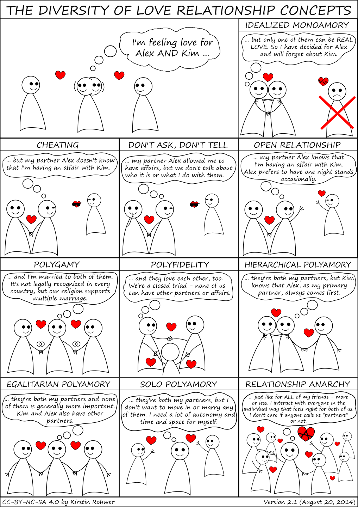
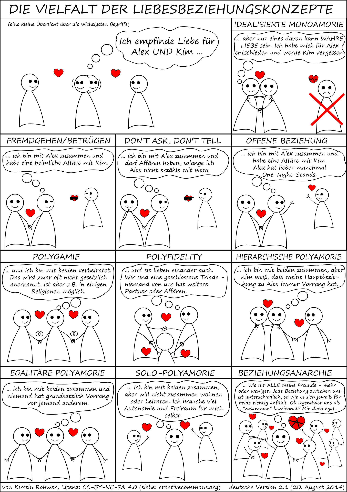

*(deutsche Version: siehe unten)*

Once upon a time, in one of the many facebook groups about polyamory... I&nbsp;was tired of people confusing the same few words over and over again, and of having no materials to quickly show them for reference.

So I made this little graphic with lots of examples: a kind of illustrated dictionary of relationship concepts. Starting from the same situation, it gives one example for each concept, showing what the little stick figure characters might do and think if they followed that concept.

It got unexpectedly popular and quickly spread around various online media about polyamory, relationship anarchy etc... it has been translated into several languages (I translated it into german myself) and even been published in a [book](https://thorntreepress.com/stories-from-the-polycule/) since then.

You can download the [english version as a png picture here](the-diversity-of-love-relationship-concepts-english.png) and the [svg source file here](the-diversity-of-love-relationship-concepts-english.svg). You can edit it with a vector graphics program like [Inkscape](https://inkscape.org/), e.g. in case you want to make a translation. To display the text correctly, you should have installed the [Segoe Print](https://www.fontsmarket.com/font-details/segoe-print) font.

...

*Es war einmal vor langer, langer Zeit, in einer der zahlreichen Facebook-Gruppen zum Thema Polyamorie... ich war genervt davon, dass die Leute dort immer wieder die gleichen Wörter durcheinander brachten und ich kein Nachschlagewerk zur Hand hatte, was ich dann mal eben schnell verlinken konnte.*

*Also habe ich diese kleine Grafik erstellt, eine Art illustriertes Wörterbuch der Beziehungskonzepte. Ausgehend von der gleichen Situation, zeigt es für jedes Konzept ein Beispiel, was die Strichfiguren-Charaktere jeweils tun und denken könnten, wenn sie dieses Konzept verwenden.*

*Es erfreute sich unerwartet großer Beliebtheit und verbreitete sich schnell in verschiedenen Online-Medien der polyamoren Community... es wurde seitdem in mehrere Sprachen übersetzt und sogar in einem [Buch](https://thorntreepress.com/stories-from-the-polycule/) abgedruckt.*

*Hier könnt ihr die deutsche Version runterladen: [als png-Bild](die-vielfalt-der-liebesbeziehungskonzepte-deutsch.png) (z.B. zur Verwendung in Online-Medien) oder [als svg-Datei](die-vielfalt-der-liebesbeziehungskonzepte-deutsch.svg). Die svg-Datei kann mit einem Vektor&shy;grafik&shy;programm wie z.B. [Inkscape](https://inkscape.org/de/) bearbeitet werden, z.B. für Übersetzungen. Damit die Schrift korrekt angezeigt wird, sollte die Schriftart [Segoe Print](https://www.fontsmarket.com/font-details/segoe-print) installiert sein.*
