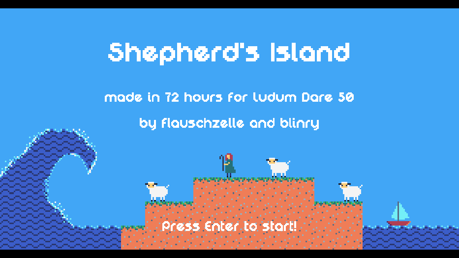

_**The water is rising! Rescue your sheep and get to the boat before it swallows everything!**_

*Shepherd's Island* is a turn-based puzzle game on a grid, with stacking objects and water flow mechanics.

[blinry](https://blinry.org) and I made this game for the [Ludum Dare 50](https://ldjam.com/) game jam - an event where you have 72 hours to create a videogame for a given theme. This time, the theme was "Delay the inevitable".

You can find download links and instructions for *Shepherd's Island* on [the Ludum Dare website](https://ldjam.com/events/ludum-dare/50/shepherds-island). Leave us a rating (until April 21st, 2022) or a comment (any time) there, if you like!

## Development

We took the greater part of the first day for brainstorming until we were satisfied with the idea for the setting and the basic game mechanics. 

Then I started with coding a prototype (using the [LÖVE](https://love2d.org/) game engine) while blinry designed some interesting level layouts and many of the pixel art graphics. Later on, we both worked on all parts of the game, switching back and forth between solo and pair programming, testing levels, picking music and sound effects, pixeling more graphics, etc.

Building the algorithm for the flooding water turned out to be a more complicated challenge than it seemed at first thought, and I'm glad that I did a large refactoring on the morning of the last day where I scrapped many lines of my previous attempt and wrote a new version with more structure. If there wasn't a time limit, I would do this to many other parts of the code, too... game jams usually lead to a lot of quick-and-dirty coding that can be hard to debug.

Despite the many ideas for improvement that we had to cut because of the game jam's time limit, I'm still quite satisfied with the result. Puzzle games are my favorite kind of game to play and it's also a lot of fun to build them!

If you'd like a closer look behind the scenes, you can find the game's [source code on GitLab](https://gitlab.com/flauschzelle/shepherds-island).

## Gameplay Trailer

Check out this little [trailer video](https://www.youtube.com/watch?v=puB4O3jCjaA) that blinry made for our game:

<%= youtube("puB4O3jCjaA") %>

