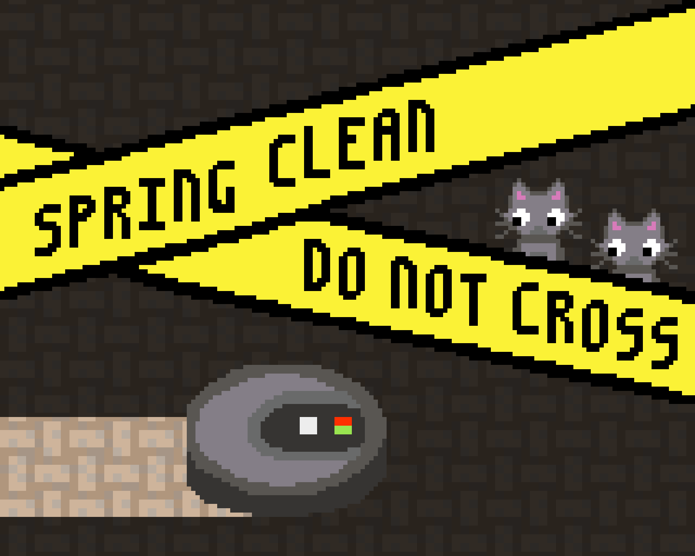

*Spring cleaning time! But be careful to protect your increasing number of cats from your roomba by drawing lots and lots of barrier tapes!*

I made this game together with [blinry](https://morr.cc) for Ludum Dare 40. This was the first time ever that I took part in a game jam.  
If you (understand German and) want to learn more about game jams, you should listen to [blinry's talk about Ludum Dare](https://morr.cc/dare-to-ludum-dare/).

The theme of Ludum Dare 40 was "The more you have, the worse it is".  
Everything is better with more cute cats, right? Well, unless you want to keep your floor clean...

You can download the game from [the Ludum Dare website](https://ldjam.com/events/ludum-dare/40/spring-clean-do-not-cross). (Note that you have to use LÖVE version <s>10.2</s> 11.3 (*updated November 2019*) if you want to run it on Linux or Mac!)

We also had a sister project, [Kittychaos](https://ldjam.com/events/ludum-dare/40/kittychaos/), created under the same roof, and partially sharing assets!

## Development

This was my first time working with Lua, and I really like the LÖVE game engine. I&nbsp;learned a lot on that weekend!  
We also had a great time recording the cute meow and purr sounds ourselves ^^

We had most of the game finished after two days and could use the whole third day for testing and bugfixing. It&nbsp;was a good choice to do this rather small project for my first game jam.

## Comments

*I love the idea. And its a nice riff on those games where you divide the floor and I think I like this better than those. It feels more strategic.* --tsuk13

*Overall cute-level is 10/10. Audio complements the visuals and pushes the cute-meter to 11/10.* --Simon Rahnasto

*Cool basic mechanics! At first simple, then cat synchronization and corralling. :P Well done!* --Joror

*I love the way the vacuum cleaner moves, it’s so stupid and inefficient and I love it.* --pogo

## Results

Results were pretty solid. We got a good Theme rating, and except for Graphics, our scores were all better than 200th place!

