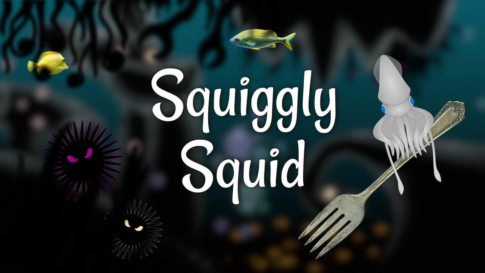
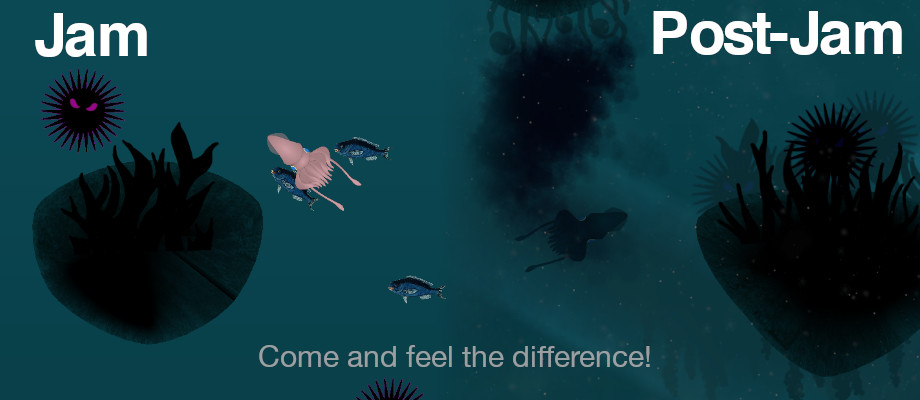

_**Explore a calm underwater world in search of curious human artifacts! What wonders does the deep sea hold?**_

Once again, some friends and I took the challenge of making a game im 72 hours for the [Ludum Dare 48](https://ldjam.com/) game jam. This time, the theme was "Deeper and deeper" and we came up with a physics-based game called *Sqiuggly Squid*, where you dive deep into the ocean as a curious squid in search of strange artifacts.

I built this game together with [blinry](https://blinry.org/) and [Lena](https://twitter.com/lenaschimmel). We used the 2d game engine [LÖVE](https://love2d.org/), which was also used for most of our previous game jam entries.

Fun fact: we built our own in-game level editor + a lot of custom rendering code for this entry! :D

You can find download links for the game on [the Ludum Dare website](https://ldjam.com/events/ludum-dare/48/squiggly-squid).

You can also download *Squiggly Squid* directly [here for Windows (64bit)](https://blinry.gitlab.io/squiggly-squid/downloads/blinry-squiggly-squid-win64.zip) and [here for Linux or MacOS](https://blinry.gitlab.io/squiggly-squid/downloads/blinry-squiggly-squid.love). For the Linux/MacOS version, you need to have [LÖVE](https://love2d.org/) 11.3 installed to play it.

If you're interested in looking behind the scenes, you can also find the game's [source code on GitLab](https://gitlab.com/blinry/squiggly-squid).

blinry also made a little [trailer video](https://www.youtube.com/watch?v=yKk3CsLEDDQ) (It contains some spoilers, you have been warned!):

<%= youtube("yKk3CsLEDDQ") %>

## Post-jam version

After the jam was over, we made some more changes to the game and published them in a **post-jam version**. You can download the post-jam version [here for Windows (64bit)](https://dielenamaria.gitlab.io/squiggly-squid-post-jam/downloads/dielenamaria-squiggly-squid-post-jam-win64.zip) and [here for Linux or MacOS](https://dielenamaria.gitlab.io/squiggly-squid-post-jam/downloads/dielenamaria-squiggly-squid-post-jam.love). The [post-jam version's source code](https://gitlab.com/dielenamaria/squiggly-squid-post-jam) is also available on GitLab.

The post-jam version includes these bug fixes and new features:

* physics are now independent of the FPS, so the gameplay and control should feel the same on every machine
* Press `B` to eject a cloud of ink (it’s not useful, but it’s fun!)
* much nicer graphics with depth of field, particles in the water, better lighting, color perspective, fluid dynamics…
* levels with more decoration, style and flair
* small jellyfishes no longer bounce around like popcorn
* Other fish behave more life-like

## Controls overview

The game can be controlled by keyboard, mouse or gamepad:

**Swim forward:** `↑` or `left mouse button`  
**Turn left/right:** `←` / `→` or `mouse movement`  
**Grab/release object:** `Space` or `right mouse button`  

**Next page:** `Space` or `left mouse button`  

**Pause:** `P` (releases the mouse cursor)  
**Quit:** `Esc`  
**Mute music:** `M`  

*(You can also customize the input mappings if you don't like the defaults. See the file path that is shown on the pause screen for that.)*

## Development

After the usual long brainstorming phase, we settled on an underwater setting and started playing around with LÖVE's physics engine to explore the game mechanics. A lot of my time went into finding, editing and creating various images of underwater plants, animals, and random objects.

I also had a lot of fun with the movement animations for both the squid and the jellyfishes.

Meanwhile, the others created a rendering engine for the landscape and underwaterwater evoironment, and an amazing in-game level editor.

As usual, we had a lot of fun testing parts of the game during development, enjoying the ever-improving graphics, physics, sound effects and funny flavor texts :D

Unfortunately, we didn't have much time left when it came to the final level design, so the finished game has only three levels, but it still makes for a fun experience of 10-15 minutes.
