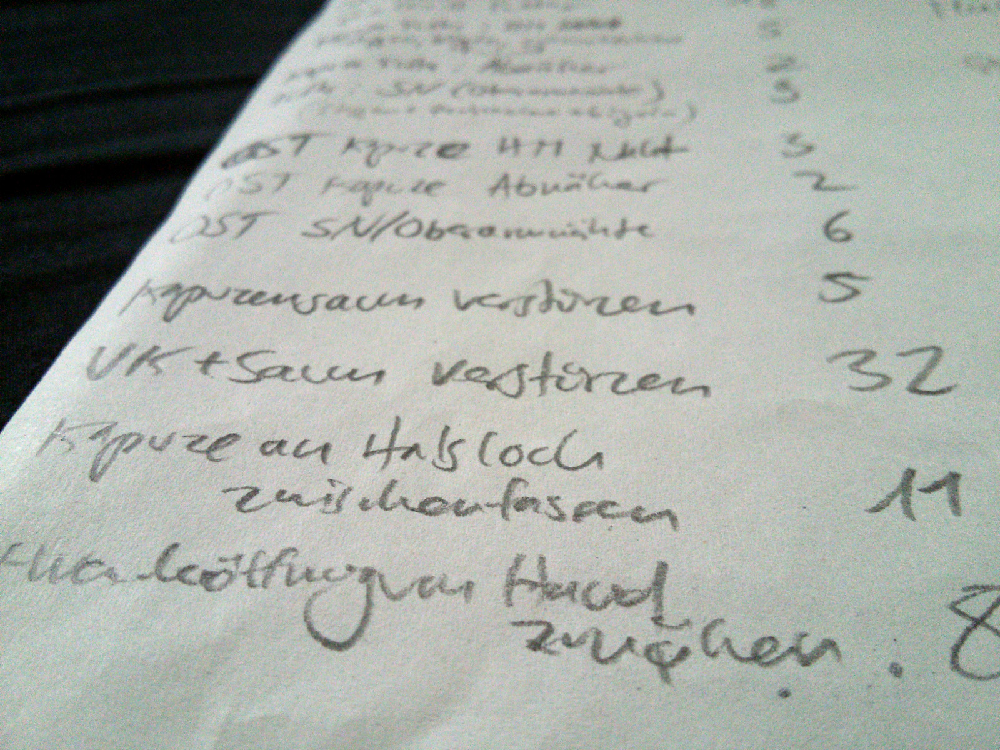

*This is my first open source desktop application software project (I've never before published any software that was neither a game nor a website).*

*Tailor's Assistant* is designed to help me in [my business as a tailor](http://ateliersonnenschein.de).

##The problem from a tailor's perspective

In contrast to the textile industry with their mass production, every workpiece I make as a tailor is unique. And that means, whenever a possible customer asks me for an offer, I probably haven't made exactly the same thing ever before.  

The price of a piece that I make is usually dependent on how long it took me to make it. To make my pricing as fair and predictable as possible, I write down (on paper) the minutes I needed for each step while working. When I'm finished, I add everything up and multiply the time I needed with my hourly price rate.  

When I get asked for an offer and haven't made something very similar before, I make a list of the steps that are needed and try to estimate how long I will take for each step. But even with nearly 10 years of experience, I can't remember how much time every possible step usually needs - there are just too many of them. And looking up all those steps from the past would take too long, because they are handwritten on many different pieces of paper.  

So, being not only a tailor but also a programmer, I decided to throw some code at the problem...  

##The solution: Tailor's Assistant

*Tailor's Assistant* provides a database where I can record the time needed for every step of every workpiece I made in the past.  

It provides a comfortable interface for input of the data to be recorded, and a similar interface for calculating a new offer, with statistics based on the times needed for the selected kinds of steps in previous workpieces.  

Workpieces and offers are saved automatically and can later be reopened and edited or deleted at any time.  

*Tailor's Assistant* also provides a possibility to export the data of a workpiece or an offer to a text file, so I can print out a list of steps for each workpiece to keep with the other papers of a customer's order.  

For a more detailed description of the functionality, [see the documentation below](#details).

I also designed a cute logo for my software project - the little blue pincushion with googly eyes was really fun to draw and I hope it will continue to make me smile whenever I use my new assistant :D

## Download and system requirements

You can download the latest release, version 0.1.0, [here](https://github.com/flauschzelle/tailors-assistant/releases/download/v0.1.0/tailors_assistant).

Although I only tested it on Ubuntu 18.04, *Tailor's Assistant* should be able to run on most current Linux systems. You will need to have *Qt5* installed to be able to run *Tailor's Assistant*. If you have *Qt5* installed and it still doesn't work, feel free to [contact me](/about/) so I can try to find out the reason.

## License

*Tailor's Assistant* is licensed under [GNU GPLv3](https://www.gnu.org/licenses/gpl-3.0.html).

## Development

The idea for this project has been sitting around in my head for several years. So when I needed to choose a software project to make for a university course this semester, I decided that the course would give me the right amount of external structure for this project.  

For the university course, it was required that I write the software in C++ and use at least one external library. I chose to work with [Qt](https://www.qt.io/), because it provides a lot of helpful functions for GUI programming and also has built-in support for database access. *Tailor's Assistant* uses an [SQLite](https://www.sqlite.org/) database for storing its data.  

*Tailor's Assistant* was my first project of this kind, so I learned a lot during the development - but that also means the code is probably quite a bit more chaotic and complex than it would have become if I had already been used to building similar projects.  

If you're curious about it anyway, you can look at the source code [here on github](https://github.com/flauschzelle/tailors-assistant).

##Detailed documentation for *Tailor's Assistant* version 0.1.0

**Some basic concepts and terminology:**

A note about language: The UI is currently only available in German language - that's why the German words from the UI are added to this text where needed, so that you can still use the software if you don't understand German.

- A **workpiece** (*Werkstück*) is any piece of clothing (or other textile thing) that has been made in the past, and whose data are recorded in *Tailors's Assistant*'s database. The metadata (*Stammdaten*) of a workpiece include the customer's name (*Kunde*), the name of the workpiece (*Bezeichnung*), the type of workpiece (*Typ*) like dress/pants/shirt/jacket/etc., the date when the workpiece was made (*Datum*), and a comment (*Kommentar*) for any other possibly relevant info. A recorded workpiece can also have a picture (*Foto*) saved with its metadata for easier recognition. A workpiece also has a list of **steps** (*Arbeitsschritte*) - see below for more info on steps.

- A **step** (*Arbeitschritt*) is any individual procedure that is a part of the process of making a workpiece, e.g. drawing the basic pattern, cutting out the pieces of fabric, sewing on a button, or sewing a hem. The data stored for a step include the name of the step (*Bezeichnung*), the number (*Anzahl*) how often the step is used in the workpiece, the seam type (*Nahttyp*), material (*Material*) used in the step, the detail (*Detail*) to which the step belongs (e.g. sleeve, collar, torso), an optional comment (*Kommentar*), and the total time (*Zeit (gesamt)*) in minutes that was needed for all instances of this step in this piece.

- An **offer** (*Angebot*) is a set of data about a workpiece that might be made in the future. It comes with the same metadata as a recorded workpiece, except for the picture. It also has a list of steps with the same data as in a recorded workpiece, and statistics about the time that was needed for similar steps in past workpieces. Steps in an offer also have the possibility to filter the base data by seam type, material, detail, and workpiece type.

When *Tailor's Assistant* is started, the main parts of the UI are disabled, except for the menu bar. The menu bar provides the following functions:

**Record workpiece (*Werkstück erfassen*) menu:**

- Create a new workpiece (*Neues Werkstück*): activates the input fields for the metadata (*Werkstück-Stammdaten*) of a new workpiece to be recorded.
- Open an exisiting workpiece (*Werkstück öffnen*): shows a list of all previously recorded workpieces. The selected workpiece can be opened for editing.
- Convert an offer into a recorded workpiece (*Werkstück aus Angebot*): shows a list of all currently stored offers. The selected offer can be opened in record mode and will then be saved as a recorded workpiece.

**Calculate offer (*Angebot kalkulieren*) menu:**

- Create a new offer (*Neues Angebot*): activates the input fields for the metadata (*Angebots-Stammdaten*) of a new offer to be calculated.  
- Open an exisiting offer (*Angebot öffnen*): shows a list of all currently stored offers. The selected offer can be opened for editing.  
- Import an offer from a recorded workpiece (*Angebot aus Werkstück importieren*): shows a list of all recorded workpieces. Data from the selected workpiece can be copied into a new offer that can then be edited.  

**Database (*Datenbank*) menu:**

- Database settings (*Datenbank-Einstellungen*): opens a dialog where you can choose which database file you want to work with. If a workpiece or offer is currently open, it will automatically be saved before the database is changed.

**Help (*Hilfe*) menu:**

- Online documentation (*Online-Dokumentation*): a link to this website.
- About Tailor's Assistant (*Über Tailor's Assistant*): opens a dialog with information about the program, like the current version number, a link to the creator's website (this one) and information about the license.

**Automatic saving**

The data of a workpiece/offer are automatically saved to the database at several points during the input process, and also whenever a new/different piece is opened or when the program is closed.

**Other functions in the UI:**

Apart from input fields for putting in the data of a workpiece to be recorded (or an offer to be calculated), the UI provides some buttons for the following functionality:

- Delete the current workpiece or offer (*Werkstück/Angebot löschen*)
- Start editing the steps (*Speichern + Schritte bearbeiten*) - for newly created pieces that don't have steps yet
- export the current workpiece/offer as a text file (*als Text exportieren*)
- Go to the previous/next step (*vorheriger Schritt/nächster Schritt*)
- Delete the current step (*diesen Schritt löschen*)
- Change the order of steps (*Reihenfolge ändern*): move the current step up/down with the arrow buttons

**Result view:**

On the right side of the input area, a table of all steps in the current piece/offer is displayed. When editing an offer, there are columns containing different statistical values that can be used for estimating the price of a requested piece. For each step, there is:

- The number of pieces that are used as base data (*Daten*) to calulate the statistics
- *Minimum*, *median*, *average* and *maximum* amount of time that was needed for this step in past workpieces (multiplied by the number of this step in the current piece)
- *Manually* input time, which can be useful if there are no or too few base data, or you already know it will be more/less work that those.

Below the table, there is an input field for the hourly price rate (*Preis in €/h*), and the sums (*Summen*) of the calculated times are displayed, as minutes, hours (with 0.1 hour precision), and Euros at the given hourly rate. This gives a quick overview of the range in which the price for making the calculated piece will probably be.

## Future perspective

I already have some ideas on how to improve *Tailor's Assistant* in future versions, but I don't know yet when I will find the time to implement them:

- Currently, all text in the UI is only in German language, because it feels more intuitive for me to use at work every day. If other people would like to use it as well, a translation into English would probably be useful. Conversely, this documentation is available only in English and could probably use a German version.  
- To save some work when choosing the steps for a new offer, steps could be suggested based on the chosen workpiece type and/or details.  
- To get more use out of the workpiece pictures, they could additionally be stored in a larger size and be displayed e.g. when hovering the mouse over the small preview image.  
- Currently, the base data for the step statistics can already be filtered by workpiece *type* – that could be improved with a functionality to show a list (in addition to the total number) of all workpiece records that are used as base data for a specific step, and the possibility to manually deselect any of them.  
- The text export function could be improved so that it can generate PDF files with nicely formatted text. That would save a few steps of preparation for printing that I currently have to do manually (set a specific font, size and line height so the TXT file fits the page better than with default values).  
