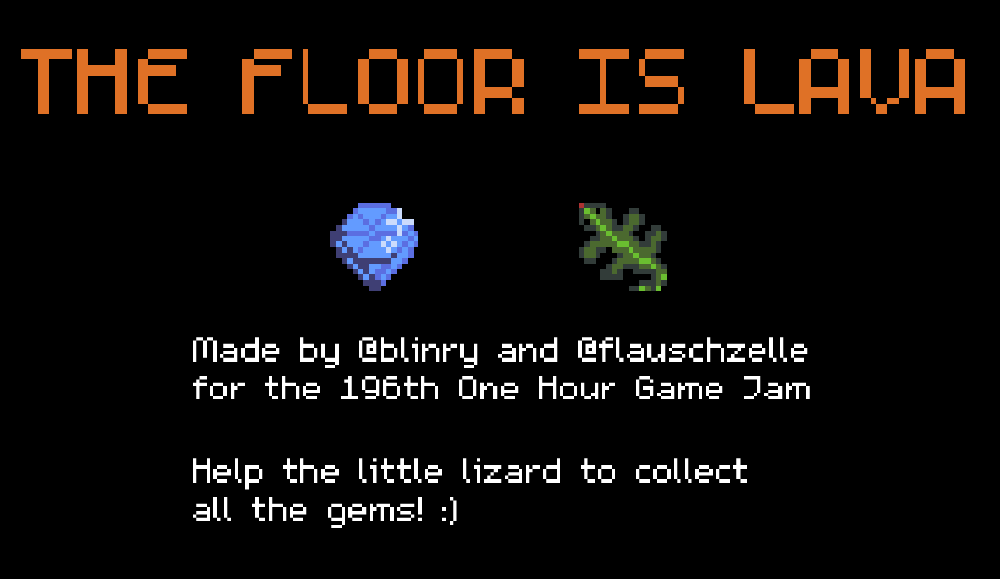
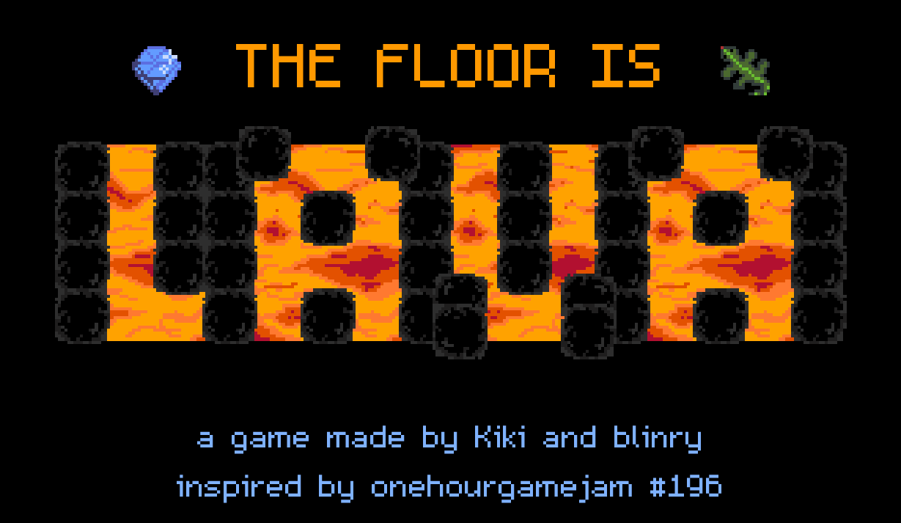
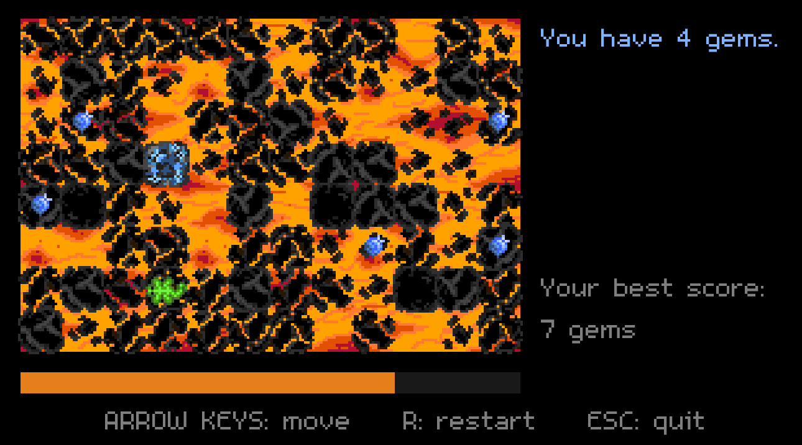

## Making a game in just one hour

Last week, [blinry](https://morr.cc) and I decided to try out the [one hour game jam](https://onehourgamejam.com). Like the name suggests, it is an event where you have one hour (or maybe up to about three hours, but that depends on how many people take part) to make a videogame for a given theme. The theme of [one hour game jam #196](https://onehourgamejam.com/?page=jam&jam=196) was "don't stop moving" and we came up with an idea in about 15 minutes, and then took about one hour to code and make some art and sounds for it, before we could submit "The Floor is Lava". Given the very short amount of time, it was more of a rough prototype, but we were still surprised how much we got done in that short time - it was already an actually playable game.

If you want to try it out, you can download the [Windows version here](https://flauschzelle.gitlab.io/ohgj196/downloads/flauschzelle-ohgj196-win32.zip) and the [Linux/MacOS version here](https://flauschzelle.gitlab.io/ohgj196/downloads/flauschzelle-ohgj196.love). For the latter one, you will need to have [LÖVE](https://love2d.org) version 11.2 installed to run the game. You can also look at the game's [source code](https://gitlab.com/flauschzelle/ohgj196) if you are interested.

## From prototype to beta version

After the game jam was over, we still had so many ideas how this kind of game could look like with more time invested into making it. We wanted to try what we could make out of it with a few more hours or days of development. And so we sat down for some more evenings during this week and continued coding, making pixel art and recording new sound effects.

Even after just these few days, the game looks soo much prettier and is much more fun to play!
We might still improve some things in the future (for example, we're thinking about adding a story mode with preset levels instead of just randomness), but I'm already very happy with the current result!

**You can play our beta version now and we would love to recieve some feedback on what you liked and what you didn't like about the game so far!**

Download it [here for Windows](https://flauschzelle.gitlab.io/the-floor-is-lava/downloads/flauschzelle-the-floor-is-lava-win32.zip) and [here for Linux/MacOS](https://flauschzelle.gitlab.io/the-floor-is-lava/downloads/flauschzelle-the-floor-is-lava.love). The latter will need you to have [LÖVE](https://love2d.org) version 11.2 installed to play the .love file.
You can also look at the current game's [source code here](https://gitlab.com/flauschzelle/the-floor-is-lava).

## Development

The game was coded in Lua, using our favorite 2d game engine [LÖVE](https://love2d.org). 
I made all the pixel art, and we recorded and edited all the sound effects ourselves – it was a lot of fun to try out which household items we could use to make sounds like cracking stones, bubbling lava, and more... :D

