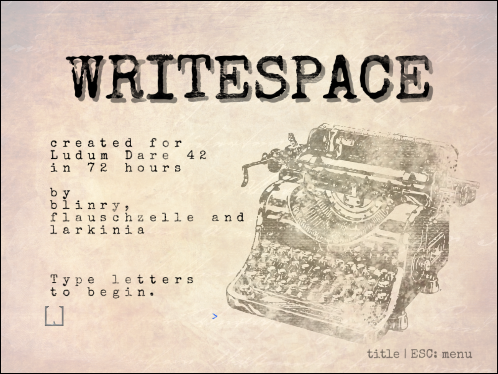
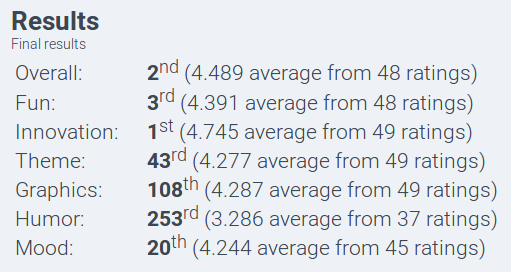

*You’re exploring a haunted house and find a strange parchment scroll. When you touch it, something terrible happens: You’re turned into a typewriter! Use your surroundings and find the magic words to lift the curse! Oh, and you can’t type spaces, of course.*

This game was made for [Ludum Dare 42](https://ldjam.com/) - an event where you have 72 hours to create a videogame for a given theme. This time, the theme was "Running out of space".

I built *Writespace* together with [blinry](https://morr.cc/) and [larkinia](https://ldjam.com/users/larkinia). On the last evening, Lena and rohieb joined us for some additional help with the graphics.

You can download the game from [the Ludum Dare website](https://ldjam.com/events/ludum-dare/42/writespace).

## Development

At first, we had planned some more complicated game mechanics. But while playing around with the first simple set of rules, we found that even with only those, there were already a lot of interesting possibilities. It was quite fun to watch each other while testing and creating new levels, and see the lots of "aha moments". We tried to include as many of them as possible in the game, so the players can have a similar experience - exploring new implications of the simple rules with every new level.

Personally, I had the most fun building some special parts of the game, like the level selection menu or the logic behind the animation in the intro level.

## Results

We got quite a lot of positive comments on the LDJAM website, but when the results of the game jam came out, we were still surprised:  
We won three trophies for this game, including the first place for innovation!  
I'm very proud of that, especially since this was only the second time that I participated in Ludum Dare (or any game jam, for that matter...)

## Coverage

There were some articles published about *Writespace* in gaming-related media (both with uncommented video recordings):

- [Alpha Beta Gamer](https://www.alphabetagamer.com/writespace-game-jam-build/)
- [gamejamcurator](https://gamejamcurator.tumblr.com/post/177162841106/ludum-dare-42-writespace)

Also, a few people recorded themselves while playing our game. I especially enjoyed watching and listening to Joshua's stream:

<%= twitch("298094346", start: "01h25m45s") %>

